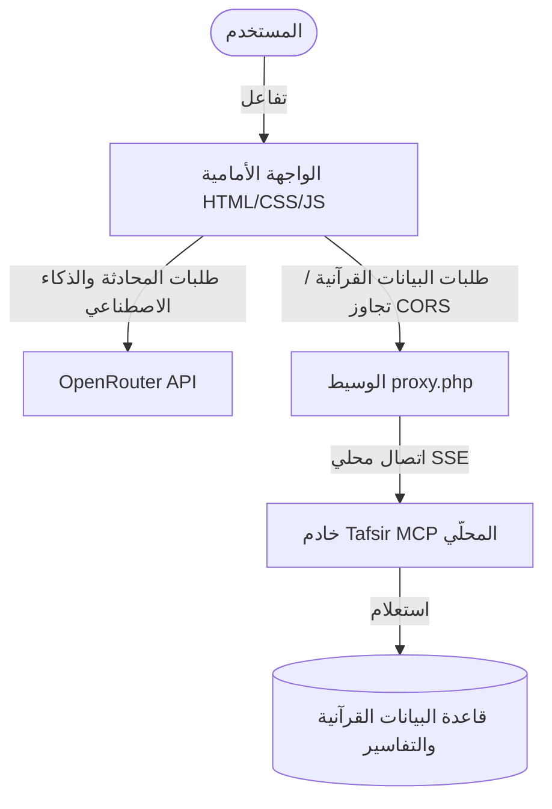

# فَسِّرْلي (Fasserly) — الباحث والمفسّر القرآني الذكي
> **Smart Quranic Search & Tafsir Client using Model Context Protocol (MCP)**

[](LICENSE)
[](https://www.python.org)
[](https://www.php.net)
[](https://modelcontextprotocol.io)

---

### [English Documentation](#english-version) | [الدليل باللغة العربية](#العربية)

---

<a name="العربية"></a>

## العربية

**فَسِّرْلي** هو تطبيق ويب متكامل ومصمم بجماليات إسلامية راقية، يدمج الذكاء الاصطناعي مع أدوات العلوم القرآنية الموثقة. يعتمد التطبيق على بروتوكول سياق النموذج (**Model Context Protocol - MCP**) للربط بين نماذج الذكاء الاصطناعي (عبر OpenRouter) وبين قاعدة بيانات تفاسير القرآن الكريم وإعرابه اللغوي وأسباب النزول المعتمدة، لمنع الهلوسة العلمية وتقديم إجابات مسندة تماماً.

### 🌟 الميزات الرئيسية
* **البحث والتفسير المعتمد:** استخراج تفاسير الآيات من أمهات كتب التفسير (تفسير ابن كثير، الجلالين، الطبري، إلخ).
* **أسباب النزول:** معرفة أسباب نزول الآيات والسور مع بيان درجة صحة الأثر الوارد.
* **التحليل النحوي والإعراب:** تقديم إعراب تفصيلي لبنية الكلمات والجمل القرآنية.
* **إحصاءات الجذور اللغوية:** البحث اللغوي المتعمق عن جذور الكلمات وتكرارها في القرآن.
* **واجهة مستخدم إسلامية راقية:** تصميم عصري جذاب يعتمد على تدرجات لونية متناغمة (ألوان إسلامية ذهبية وخضراء)، تأثيرات الزجاج (Glassmorphism)، وخطوط عربية كلاسيكية جميلة (Amiri, Tajawal, Reem Kufi).
* **إدارة الاتصال الآمن:** إدخال مفتاح OpenRouter وتحديد النموذج وحفظها محلياً بأمان تام في المتصفح.

---

### 🏗️ بنية وهيكلية النظام (Architecture)

يعمل المشروع وفق نموذج ثلاثي الطبقات يضمن السرعة وتجاوز قيود CORS المحلية:



---

### 🚀 متطلبات التشغيل (Prerequisites)
1. **بايثون (Python 3.8 أو أحدث):** لتشغيل خادم Tafsir MCP.
2. **بيئة خادم ويب محلي يدعم PHP:** مثل **XAMPP** أو **WampServer** أو خادم PHP المدمج.
3. **مفتاح اتصال OpenRouter API Key:** للاتصال بنماذج الذكاء الاصطناعي (مثل Gemini 3.5 Flash).

---

### 🛠️ طريقة التثبيت والتشغيل بالتفصيل

#### الخطوة 1: تشغيل خادم التفسير المحلي (Tafsir MCP Server)
يحتوي المشروع على ملف دفعي (`start_server.bat`) يقوم تلقائياً بتهيئة الخادم وتنزيل الاعتمادات وقاعدة البيانات.

* **باستخدام ملف bat (ويندوز):**
  قم بالنقر المزدوج على ملف `start_server.bat` وسيقوم بالآتي:
  1. التحقق من وجود بايثون.
  2. تثبيت مكتبة `tafsir-mcp` ومستلزماتها.
  3. تنزيل قاعدة البيانات القرآنية (بحجم ~214MB تقريباً، وتُنزّل لمرة واحدة فقط).
  4. تشغيل خادم MCP المحلي على المنفذ `http://localhost:8000/sse`.

* **الطريقة اليدوية (عبر الطرفية):**
  إذا كنت تستخدم نظام تشغيل آخر أو تفضل العمل يدوياً:
  ```bash
  # 1. تثبيت الاعتمادات
  pip install -r requirements.txt

  # 2. تشغيل الخادم
  python run_tafsir.py
  ```

#### الخطوة 2: تهيئة الواجهة الأمامية ووسيط PHP
1. قم بنسخ مجلد المشروع بالكامل إلى مجلد الـ root الخاص بخادم الويب المحلي (مثال في XAMPP: `C:\xampp\htdocs\Fasserly`).
2. تأكد من تشغيل Apache من لوحة تحكم XAMPP.
3. افتح متصفح الويب واذهب إلى العنوان التالي:
   ```text
   http://localhost/Fasserly/index.html
   ```

#### الخطوة 3: ربط الذكاء الاصطناعي وبدء الاستخدام
1. عند فتح التطبيق، اضغط على زر **"إعدادات الاتصال والمفتاح"** في القائمة الجانبية.
2. أدخل مفتاح **OpenRouter API Key** الخاص بك.
3. اختر النموذج المفضل (مثل `Gemini 3.5 Flash` أو `Gemini 3.1 Flash Lite`).
4. اضغط على **"حفظ الإعدادات وبدء الاتصال"**.
5. ستلاحظ تحول نقطة الحالة بالأسفل إلى اللون الأخضر لتؤكد الاتصال بنجاح. ابدأ الآن في طرح أسئلتك القرآنية!

---

### 📂 ملفات المشروع (Project Structure)
* `index.html`: هيكل واجهة المستخدم والتنسيقات الهيكلية.
* `styles.css`: تنسيقات الواجهة ونظام الألوان الإسلامي والمؤثرات البصرية.
* `app.js`: منطق التحكم، إدارة المحادثة، محاكاة بروتوكول MCP للمتصفح، والتواصل مع OpenRouter.
* `proxy.php`: خادم وسيط لحل مشكلة CORS ومرور بيانات SSE بشكل سلس مع XAMPP.
* `run_tafsir.py`: الكود المشغل لخادم بايثون Tafsir MCP.
* `start_server.bat`: ملف دفعي لتثبيت وتشغيل خادم بايثون في بيئة ويندوز بضغطة زر.
* `requirements.txt`: الحزم البرمجية المطلوبة لخادم بايثون.
* `.gitignore`: قائمة بالملفات المؤقتة والملفات غير المرغوب في تتبعها برمجياً.
* `LICENSE`: ترخيص المشروع (MIT).

---

<a name="english-version"></a>

## English Version

**Fasserly** is a beautifully crafted web application with a premium Islamic aesthetic, combining Generative AI with authenticated Quranic sciences. Leveraging the **Model Context Protocol (MCP)**, Fasserly bridges advanced LLMs (via OpenRouter) with local Quranic databases (tafsir, parsing, syntax, and reasons of revelation) to prevent AI hallucinations and provide verified references.

### 🌟 Key Features
* **Verified Tafsir Lookup:** Fetch explanations from authoritative tafsirs (Ibn Kathir, Al-Jalalayn, Al-Tabari, etc.).
* **Nuzool Reasons:** Explore reasons of revelation for verses with authentication metadata.
* **Grammatical Parsing & Syntax:** Access detailed Arabic grammar (I'rab) and morphology analysis.
* **Word Roots Statistics:** Search and display occurrences and statistical weights of root words.
* **Premium Islamic Aesthetic:** Elegant dark/light glassmorphic UI, tailored with custom golden and emerald gradients, smooth animations, and classical Arabic typography (Amiri, Tajawal, Reem Kufi).
* **Safe Local Settings:** Save OpenRouter API keys locally in the browser's `localStorage` securely.

---

### 🚀 Getting Started

#### Step 1: Run the Tafsir MCP Python Server
The repository includes a batch script to automate server setup.

* **On Windows (using the bat script):**
  Double-click `start_server.bat`. It will check for Python, install `tafsir-mcp` and `uvicorn`, download the ~214MB Quran database (one-time download), and launch the SSE server on `http://localhost:8000/sse`.

* **Manual Setup (Cross-platform):**
  ```bash
  # 1. Install dependencies
  pip install -r requirements.txt

  # 2. Run the server
  python run_tafsir.py
  ```

#### Step 2: Host the Frontend
1. Move the project folder to your local server's root directory (e.g., `C:\xampp\htdocs\Fasserly` for XAMPP).
2. Start the Apache server from the XAMPP control panel.
3. Open your browser and navigate to:
   ```text
   http://localhost/Fasserly/index.html
   ```

#### Step 3: Configure settings
1. Click the **"إعدادات الاتصال والمفتاح"** (Connection & Key Settings) button on the sidebar.
2. Provide your **OpenRouter API Key**.
3. Select your preferred LLM model (e.g., Gemini 3.5 Flash).
4. Click **"حفظ الإعدادات وبدء الاتصال"** (Save & Connect).
5. The status indicator will turn green, indicating the system is ready for queries!

---

### 📂 Repository Contents
* `index.html`: The markup of the chat dashboard.
* `styles.css`: Custom Islamic-themed stylesheet.
* `app.js`: Main frontend logic, SSE handling, tiny MCP client, and OpenRouter api client.
* `proxy.php`: CORS proxy script to bypass browser restrictions.
* `run_tafsir.py`: Python script launching the local Tafsir MCP server.
* `start_server.bat`: Windows batch script for automated environment setup.
* `requirements.txt`: Python package requirements.
* `.gitignore`: Excluded temporary and system files from git.
* `LICENSE`: MIT License.

---

## 📜 رخصة الاستخدام / License
هذا المشروع مرخص بموجب رخصة **MIT**. لمزيد من التفاصيل راجع ملف [LICENSE](LICENSE).
This project is licensed under the **MIT License**. For details, see the [LICENSE](LICENSE) file.
